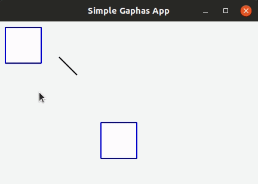

# Gaphas

[](https://travis-ci.com/gaphor/gaphas)

[](https://coveralls.io/github/gaphor/gaphas?branch=master)
[](https://github.com/ambv/black)
[](https://github.com/RichardLitt/standard-readme)
[](https://gitter.im/Gaphor/Lobby?utm_source=badge&utm_medium=badge&utm_campaign=pr-badge&utm_content=badge)
[](#contributors)

> Gaphas is the diagramming widget library for Python.



Gaphas is a library that provides the user interface component (widget) for drawing diagrams. Diagrams can be drawn to screen and then easily exported to a variety of formats, including SVG and PDF. Want to build an app with chart-like diagrams? Then Gaphas is for you! Use this library to build a tree, network, flowchart, or other diagrams.

This library is currently being used by [Gaphor](https://github.com/gaphor/gaphor) for UML drawing,
[RAFCON](https://github.com/DLR-RM/RAFCON) for state-machine based robot control, and [ASCEND](http://ascend4.org/) for solving mathematical models.

## :bookmark_tabs: Table of Contents

- [Background](#background)
- [Install](#install)
- [Usage](#usage)
- [API](#api)
- [Contributing](#contributing)
- [License](#license)

## :scroll: Background

Gaphas was built to provide the foundational diagramming portions of [Gaphor](https://github.com/gaphor/gaphor). Since Gaphor is built on GTK and Cairo, [PyGObject](https://pygobject.readthedocs.io/) provides access to the GUI toolkit and [PyCairo](https://pycairo.readthedocs.io/) to the 2D graphics library. However, there wasn't a project that abstracted these technologies to easily create a diagramming tool. Hence, Gaphas was created as a library to allow others to create a diagramming tool using GTK and Cairo.

Here is how it works:

- Items (Canvas items) can be added to a Canvas.
- The Canvas maintains the tree structure (parent-child relationships between items).
- A constraint solver is used to maintain item constraints and inter-item constraints.
- The item (and user) should not be bothered with things like bounding-box calculations.
- Very modular--e.g., handle support could be swapped in and swapped out.
- Rendering using Cairo.

The main portions of the library include:

- canvas - The main canvas class (container for Items).
- items - Objects placed on a Canvas.
- solver - A constraint solver to define the layout and connection of items.
- view - Responsible for the calculation of bounding boxes which is stored in a quadtree data structure for fast access.
- gtkview - A view to be used in GTK applications that interacts with users with tools.
- painters - The workers used to paint items.
- tools - Tools are used to handle user events (such as mouse movement and button presses).
- aspects - Provides an intermediate step between tools and items.

## :floppy_disk: Install

To install Gaphas, simply use pip:

```bash
$ pip install gaphas
```

Use of a
[virtual environment](https://virtualenv.pypa.io/en/latest/) is highly recommended.

### Development

To setup a development environment with Linux:

```bash
$ sudo apt-get install -y python3-dev python3-gi python3-gi-cairo
    gir1.2-gtk-3.0 libgirepository1.0-dev libcairo2-dev
$ pip install poetry
$ poetry install
```

## :flashlight: Usage

```python
import gi
gi.require_version("Gtk", "3.0")
from gi.repository import Gtk

from gaphas import Canvas, GtkView
from gaphas.examples import Box
from gaphas.painter import DefaultPainter
from gaphas.item import Line
from gaphas.segment import Segment


def create_canvas(canvas, title):
    # Setup drawing window
    view = GtkView()
    view.painter = DefaultPainter()
    view.canvas = canvas
    window = Gtk.Window()
    window.set_title(title)
    window.set_default_size(400, 400)
    win_box = Gtk.Box(orientation=Gtk.Orientation.HORIZONTAL)
    window.add(win_box)
    win_box.pack_start(view, True, True, 0)

    # Draw gaphas box
    b2 = Box(60, 60)
    b2.min_width = 40
    b2.min_height = 50
    b2.matrix.translate(170, 170)
    canvas.add(b2)

    # Draw gaphas line
    line = Line()
    line.matrix.translate(100, 60)
    canvas.add(line)
    line.handles()[1].pos = (30, 30)
    segment = Segment(line, view=None)
    segment.split_segment(0)

    window.show_all()
    window.connect("destroy", Gtk.main_quit)


c = Canvas()
create_canvas(c, "Simple Gaphas App")
Gtk.main()
```

### Overview

The `Canvas` class acts as a container for Item's . The item's parent/child relationships are maintained here, not in the `Item`.

An `Item` can have a set of handles which can be used to manipulate the item (although this is not necessary). Each item has its own coordinate system with x and y position, for example, a (0, 0) point `Item.matrix` is the transformation relative to the parent item of the `Item`, as defined in the `Canvas`.

Handles can connect to [ports](https://gaphas.readthedocs.io/en/latest/ports.html). A `Port` is a location (line or point) where a handle is allowed to connect on another
item. The process of connecting depends on the case at hand, but most often involves the creation of some sort of constraint between the Handle and the item it is connecting to.

The Canvas also contains a [constraint solver](https://gaphas.readthedocs.io/en/latest/solver.html) (from solver.py) that can be used to solve mathematical dependencies
between items (such as Handles that should be aligned). The constraint solver can also be used to keep constraints contained within the item satisfied, for example, to make sure a box maintains its rectangular shape.

A View is used to visualize a Canvas. On a View, a Tool (from tool.py) can be applied, which will handle user input like button and key presses. Painters (from painter.py) are used to do the actual drawing. This module also makes it easy to draw to other media other than a screen, such as a printer or a PDF document.

### Updating Item state

If items need updating, it sends out an update request on the Canvas (`Canvas.request_update()`). The canvas
performs an update by performing the following steps:

1. Pre-update using `Item.pre_update(context)` for each item marked for update.
2. Update the Canvas-to-Item matrices, for fast transformation of coordinates from the Canvas' to the items' coordinate      system.
3. Solve the constraints.
4. Normalize the items by setting the coordinates of the first handle to (0, 0).
5. Update the Canvas-to-Item matrices for items that have been changed by normalization.
6. Post-update using `Item.post_update(context)` for each item marked for update, including items that have been
   marked during the constraint solving step.

Gaphas attempts to do as much updating as possible in the {pre|post}_update() methods, since they are called when the application is not handling user input.

The context contains a CairoContext. This can be used, for example, to calculate the dimensions of text. One thing to keep in mind is that updating is done from the Canvas. Items should not update sub-items. After the update steps are complete, the Item should be ready to be drawn.

### Constraint solving

Constraint solving is one of the big features of this library. The Solver is able to mathematically solve these constraint rules that are applied to an item or between items. Constraints are applied to items through variables owned by
the item. An example of applying a constraint to an item is that Element items use constraints to maintain their rectangular shape. An example of applying constraints between items is to apply a constraint between a line and a box in
order to connect them.

Constraints that apply to one item are pretty straight forward, as all variables live in the same coordinate system of the item. The variables, like the Handle's x and y coordinate can simply be put in a constraint.

When two items are connected to each other and constraints are created, a problem shows up: variables live in separate coordinate systems. In order to overcome this problem, a Projection (from solver.py) has been defined. With a
Projection instance, a variable can be "projected" on another coordinate system. In this case, the Canvas' coordinate system is used when two items are connected to each other.

### Drawing

Drawing is done by the View. All items marked for redraw, the items that have been updated, will be drawn in the order in which they reside in the Canvas. The order starts with the first root item, then its children, then second root item, etc.

The view context passed to the Items draw() method has the following properties:

- view - The view we're drawing to.
- cairo - The CairoContext to draw to.
- selected - True if the item is actually selected in the view.
- focused - True if the item has the focus
- hovered - True if the mouse pointer if over the item. Only the top-most item is marked as hovered.
- dropzone - The item is marked as the drop zone. When this happens then an item is dragged over the item, and if it is     dropped, it will become a child of this item.
- draw_all - True if everything drawable on the item should be drawn, for example, when calculating the bounding boxes of   an item.

The View automatically calculates the bounding box for the item, based on the items drawn in the draw (context) function (this is only done when really necessary, e.g., after an update of the item). The bounding box is in viewport coordinates.

The actual drawing is done by Painters (painter.py). A series of Painters have been defined: one for handles, one for items, etc.

### Tools

Behaviour is added to the Canvas (view) by tools. Tools can be chained together in order to provide more complex behaviour.

To make it easy, a DefaultTool has been defined which is a ToolChain instance with the tools added as follows:

- ToolChain - Delegates to a set of individual tools and keeps track of which tool has grabbed the focus. This normally     happens when the user presses a mouse button. Once this happens, the tool requests a "grab" and all events, like motion   or button release, are sent directly to the focused tool.

- HoverTool - Makes the item under the mouse button the "hovered item." When such an item is drawn, its context.hovered_item flag will be set to True.

- HandleTool - Allows for handles to be dragged around and focuses the item when its handle is clicked on.

- ItemTool - Selects items and enables dragging items around.

- TextEditTool - A demo tool that features a text edit pop-up.

- RubberbandTool - Invoked when the mouse button is pressed on a section of the view where no items or handles are present. It allows the user to select items using a "rubber band" selection box.

### Interaction

Tools handle Interaction with the Canvas view (visual component). Although the default tools do a fair amount of work, in most cases you'll desire to create some custom connection behaviour. In order to implement these, HandleTool provides hooks including connect, disconnect, and glue.

One of the challenges you'll likely face is what to do when an item is removed from the Canvas and there are other items (lines) connected to it. Gaphas provides a solution to this by providing a disconnect handler to the handle instance once it is connected. A function can be assigned to this disconnect handler, which is then called when the item that is connected to is removed from the Canvas.

### Undo

Gaphas has a simple built-in system for registering changes in its classes and notifying the application. This code resides in state.py.

There is also a "reverter" framework in place. This system is notified when objects change their state, and the framework will figure out the reverse operation that has to be applied in order to undo the operation.

## :mag: API

The API can be separated into a [Model-View-Controller](https://en.wikipedia.org/wiki/Model%E2%80%93view%E2%80%93controller) with these three parts:

1. The Model, including the canvas and items
2. The View, called view
3. The Controller, called tools

### Canvas and Items

#### Class: `gaphas.canvas.Canvas`

The `Canvas` is a container for items.

```python
canvas = Canvas()
```

#### Class: `gaphas.item.Item`

Base class (or interface) for items on a `Canvas`.

```python
item = Item()
```

##### Properties:

- `matrix`: The item's transformation matrix
- `canvas`: The canvas, which owns an item
- `constraints`: list of item constraints, automatically registered when the item is added to a canvas; may be extended in subclasses

#### Class: `gaphas.connector.Handle`

Handles are used to support modifications of Items.

If the handle is connected to an item, the `connected_to` property should refer to the item. A `disconnect` handler should
be provided that handles the required disconnect behaviour, for example, cleaning up the constraints and `connected_to`.

- pos (`gaphas.connector.Position`): The position of the item, default value is (0, 0).
- strength (int): The strength of the handle to use in the constraint solver; default value is NORMAL, which is 20.
- connectable (bool): Makes the handle connectable to other items; default value is False.
- movable (bool): Makes the handle moveable; default value is True.

  ```python
  handle = Handle((10, 10), connectable=True)
  ```

#### Class: `gaphas.connector.LinePort`

The Line Port is part of an item that provides a line between two handles.

- start (`gaphas.connector.Position`): The start position of the line.
- end (`gaphas.connector.Position`): The end position of the line.

```python
p1, p2 = (0.0, 0.0), (100.0, 100.0)
port = LinePort(p1, p2)
```

#### Class: `gaphas.connector.PointPort`

The Point Port connects the handle to an item using a port at the location of the handle.

```python
h = Handle((10, 10))
port = PointPort(h.pos)
```

#### Class: `gaphas.solver.Solver`

A Solver solves constraints.

```python
a, b, c = Variable(1.0), Variable(2.0), Variable(3.0)
solver = Solver()
c_eq = EquationConstraint(lambda a,b: a+b, a=a, b=b)
solver.add_constraint(c_eq)
```

#### Class: `gaphas.constraint.EqualsConstraint`

Make 'a' and 'b' equal.

```python
a, b = Variable(1.0), Variable(2.0)
eq = EqualsConstraint(a, b)
eq.solve_for(a)
```

#### Class: `gaphas.constraint.LessThanConstraint`

Ensure one variable stays smaller than another.

```python
a, b = Variable(3.0), Variable(2.0)
lt = LessThanConstraint(smaller=a, bigger=b)
lt.solve_for(a)
```

#### Class: `gaphas.constraint.CenterConstraint`

Ensures a Variable is kept between two other variables.

```python
a, b, center = Variable(1.0), Variable(3.0), Variable()
eq = CenterConstraint(a, b, center)
eq.solve_for(a)
```

#### Class: `gaphas.constraint.EquationConstraint`

Solve a linear equation.

```python
a, b, c = Variable(), Variable(4), Variable(5)
cons = EquationConstraint(lambda a, b, c: a + b - c, a=a, b=b, c=c)
cons.solve_for(a)
```

#### Class: `gaphas.constraint.BalanceConstraint`

Keeps three variables in line, maintaining a specific ratio.

```python
a, b, c = Variable(2.0), Variable(3.0), Variable(2.3, WEAK)
bc = BalanceConstraint(band=(a,b), v=c)
c.value = 2.4
```

#### Class: `gaphas.constraint.LineConstraint`

Solves the equation where a line is connected to a line or side at a specific point.

```python
line = (Variable(0), Variable(0)), (Variable(30), Variable(20))
point = (Variable(15), Variable(4))
lc = LineConstraint(line=line, point=point)
```

### View

#### Class: `gaphas.view.View`

View class for `gaphas.canvas.Canvas` objects.

```python
canvas = Canvas()
view = View(canvas=canvas)
```

#### Class: `gaphas.view.GtkView`

GTK+ widget for rendering a `gaphas.canvas.Canvas` to a screen.

```python
canvas = Canvas()
win = Gtk.Window()
view = GtkView(canvas=canvas)
win.add(view)
```

#### Class: `gaphas.painter.PainterChain`

Chain up a set of painters.

```python
view.painter = (
    PainterChain()
    .append(FreeHandPainter(ItemPainter()))
    .append(HandlePainter())
    .append(FocusedItemPainter())
    .append(ToolPainter())
)
```

#### Class: `gaphas.painter.DrawContext`

Special context for drawing the item. It contains a cairo context and properties like selected and focused.

- **kwargs: Optional cairo properties for a context.

```python
DrawContext(
    painter=self,
    cairo=cairo,
    selected=(item in view.selected_items),
    focused=(item is view.focused_item),
    hovered=(item is view.hovered_item),
    dropzone=(item is view.dropzone_item),
    draw_all=self.draw_all,
)
```

#### Class: `gaphas.painter.ItemPainter`

Painter to draw an item.

```python
svgview = View(view.canvas)
svgview.painter = ItemPainter()
```

#### Class: `gaphas.painter.CairoBoundingBoxContext`

It is used to intercept `stroke()`, `fill()`, and other context operations so that the bounding box of the item involved can be calculated.

- cairo (cairo.Context): The cairo context to intercept.

```python
cairo = CairoBoundingBoxContext(cairo)
```

#### Class: `gaphas.painter.BoundingBoxPainter`

A type of ItemPainter which is used to calculate the bounding boxes (in canvas coordinates) for the items.

```python
view.bounding_box_painter = BoundingBoxPainter()
```

#### Class: `gaphas.painter.HandlePainter`

Draw handles of items that are marked as selected in the view.

#### Class: `gaphas.painter.ToolPainter`

Allows the Tool defined on a view to conduct drawing.

#### Class: `gaphas.painter.FocusedItemPainter`

Used to draw on top of all the other layers for the focused item.

### Tools

Interacting with the Canvas is done through tools. Tools tell _what_ has to be done (like moving). To make an element move aspects are defined. Aspects tell how the behaviour has to be performed.

#### Class: `gaphas.tools.ToolChain`

Used to chain tools together. For example, chain a HoverTool, HandleTool, and SelectionTool in order to combine their functionality in to a new tool.

- view (`gaphas.view.View`): The view to use for the tool chain.

```python
(ToolChain(view)
.append(HoverTool())
.append(ConnectHandleTool())
.append(PanTool())
.append(ZoomTool())
.append(ItemTool())
.append(TextEditTool())
.append(RubberbandTool())
)
```

#### Class: `gaphas.tools.HoverTool`

Makes the item under the mouse cursor the hovered item.

- view (`gaphas.view.View`): The view to use for the tool; default is None.

#### Class: `gaphas.tools.ItemTool`

Does selection and dragging of items.

- view (`gaphas.view.View`): The view to use for the tool; default is None.

#### Class: `gaphas.tools.HandleTool`

Tool to move handles around.

- view (`gaphas.view.View`): The view to use for the tool; default is None.

#### Class: `gaphas.tools.RubberbandTool`

Allows the user to drag a "rubber band" for selecting items in an area.

- view (`gaphas.view.View`): The view to use for the tool; default is None.

#### Class: `gaphas.tools.PanTool`

Captures drag events with the middle mouse button and uses them to translate the Canvas within the view.

- view (`gaphas.view.View`): The view to use for the tool; default is None.

#### Class: `gaphas.tools.ZoomTool`

Tool for zooming using two different user inputs:

1. Ctrl + middle-mouse dragging in the up and down direction
2. Ctrl + mouse-wheel

- view (`gaphas.view.View`): The view to use for the tool; default is None.

#### Class: `gaphas.tools.PlacementTool`

Tool for placing items on the Canvas.

- view (`gaphas.view.View`): The view to use for the tool.
- factory (factory object): A Canvas item factory for creating new items.
- handle_tool (`gaphas.tools.HandleTool`): The handle tool to use.
- handle_index (int): The index of the handle to be used by the handle tool.

```python
def on_clicked(button):
    view.tool.grab(PlacementTool(view, factory(view, MyLine), HandleTool(), 1))
```

#### Class: `gaphas.aspects.ItemFinder`

Find an item on the Canvas.

- view (`gaphas.view.View`): The view to use in order to search for an item.

#### Class: `gaphas.aspects.ItemSelection`

Manages selection and unselection of items.

- item (`gaphas.item.Item`): The item to set as focused or unfocused.
- view (`gaphas.view.View`): The view to focus or unfocus on.

#### Class: `gaphas.aspects.ItemInMotion`

Manages motion of an item.

- item (`gaphas.item.Item`): The item to move.
- view (`gaphas.view.View`): The view to to use for move coordinates.

#### Class: `gaphas.aspects.ItemHandleFinder`

Finds handles.

- item (`gaphas.item.Item`): The item.
- view (`gaphas.view.View`): The view to get the handle at the position from.

```python
canvas = Canvas()
line = Line()
canvas.add(line)
view = View(canvas)
finder = HandleFinder(line, view)
```

#### Class: `gaphas.aspects.ElementHandleSelection`

Selects the handle of a `gaphas.item.Element`.

- item (`gaphas.item.Item`): The Element item that the handle belongs to.
- handle (`gaphas.connector.Handle`): The handle to select or unselect.
- view (`gaphas.view.View`): The view that can be used to apply the cursor to.

#### Class: `gaphas.aspects.ItemHandleInMotion`

Move a handle.

- item (`gaphas.item.Item`): The item that the handle belongs to.
- handle (`gaphas.connector.Handle`): The handle to move.
- view (`gaphas.view.View`): The view to use for the coordinate system.

#### Class: `gaphas.aspects.ItemConnector`

Connect or disconnect an item's handle to another item or port.

- item (`gaphas.item.Item`): The item that the handle belongs to.
- handle (`gaphas.connector.Handle`): The handle to connect.

#### Class: `gaphas.aspects.ItemConnectionSink`

Makes an item a sink, which is another item that an item's handle is connected to like a connected item or port.

- item (`gaphas.item.Item`): The item to look for ports on.
- port (`gaphas.connector.Port`): The port to use as the sink.

#### Class: `gaphas.aspects.ItemPaintFocused`

Paints on top of all items, just for the focused item and only when it's hovered (see
 `gaphas.painter.FocusedItemPainter`).

- item (`gaphas.item.Item`): The focused item.
- view (`gaphas.view.View`): The view to paint with.

### Extended Behaviour

By importing the following modules, extra behaviour is added to the default view behaviour.

#### Class: `gaphas.segment.LineSegment`

Split and merge line segments.

- item (`gaphas.item.Item`): The item of the segment.
- view (`gaphas.view.View`): The view to use for the split coordinate system.

#### Class: `gaphas.segment.SegmentHandleFinder`

Extends the `gaphas.aspects.ItemHandleFinder` to find a handle on a line, and create a new handle if the mouse is located between two handles. The position aligns with the points drawn by the SegmentPainter.

- item (`gaphas.item.Item`): The item.
- view (`gaphas.view.View`): The view to get the handle at the position from.

#### Class: `gaphas.segment.SegmentHandleSelection`

Extends the `gaphas.aspects.ItemHandleSelection` to merge segments if the handle is released.

- item (`gaphas.item.Item`): The item that the handle belongs to.
- handle (`gaphas.connector.Handle`): The handle to select or unselect.
- view (`gaphas.view.View`): The view to use to apply the cursor to.

#### Class: `gaphas.segment.LineSegmentPainter`

This painter draws pseudo-handles on a `gaphas.item.Line` by extending `gaphas.aspects.ItemPaintFocused`. Each line can be split by dragging those points, which will result in a new handle.

ConnectHandleTool takes care of performing the user interaction required for this feature.

- item (`gaphas.item.Item`): The focused item.
- view (`gaphas.view.View`): The view to paint with.

#### Class: `gaphas.guide.ElementGuide`

Provides a guide to align items for `gaphas.item.Element`.

- item (`gaphas.item.Item`): The item to provide guides for.

#### Class: `gaphas.guide.LineGuide`

Provides a guide to align items for `gaphas.item.Line`.

- item (`gaphas.item.Item`): The item to provide guides for.

#### Class: `gaphas.guide.GuidedItemInMotion`

Move the item and lock the position of any element that's located at the same position.

- item (`gaphas.item.Item`): The item to move.
- view (`gaphas.view.View`): The view with guides to use for move coordinates.

```python
canvas = Canvas()
view = GtkView(canvas)
element = Element()
guider = GuidedItemInMotion(element, view)
guider.start_move((0, 0))
```

#### Class: `gaphas.guide.GuidedItemHandleInMotion`

Move a handle and lock the position of any element that's located at the same position.

- item (`gaphas.item.Item`): The item that the handle belongs to.
- handle (`gaphas.connector.Handle`): The handle to move.
- view (`gaphas.view.View`): The view with guides to use for the coordinate system.

#### Class: `gaphas.guide.GuidePainter`

Paints on top of all items with guides, just for the focused item and only when it's hovered.

- item (`gaphas.item.Item`): The focused item.
- view (`gaphas.view.View`): The view with guides to paint with.

### Miscellaneous

#### Class: `gaphas.tree.Tree`

A Tree structure with the nodes stored in a depth-first order.

```python
tree = Tree()
tree.add("node1")
tree.add("node2", parent="node1")
```

#### Class: `gaphas.matrix.Matrix`

Adds @observed messages on state changes to the cairo.Matrix.

- xx (float): xx component of the affine transformation
- yx (float): yx component of the affine transformation
- xy (float): xy component of the affine transformation
- yy (float): yy component of the affine transformation
- x0 (float): X translation component of the affine transformation
- y0 (float): Y translation component of the affine transformation

```python
matrix = Matrix(1, 0, 0, 1, 0, 0)
```

#### Class: `gaphas.table.Table`

Table is a storage class that can be used to store information, like one would in a database table, with indexes on the desired "columns." It includes indexing and is optimized for lookups.

- columns (tuple): The columns of the table.
- index (tuple):

```python
from collections import namedtuple
C = namedtuple('C', "foo bar baz")
s = Table(C, (2,))
```

#### Class: `gaphas.quadtree.Quadtree`

A quadtree is a tree data structure in which each internal node has up to four children. Quadtrees are most often used to partition a two

- bounds (tuple): The boundaries of the quadtree (x, y, width, height).
- capacity (int); The number of elements in one tree bucket; default is 10.

```python
qtree = Quadtree((0, 0, 100, 100))
```

#### Class: `gaphas.geometry.Rectangle`

Rectangle object which can be added (union), substituted (intersection), and points and rectangles can be tested to be in the rectangle.

- x (int): X position of the rectangle.
- y (int): Y position of the rectangle.
- width (int): Width of the rectangle.
- height (int): Hiehgt of the rectangle.

```python
rect = Rectangle(1, 1, 5, 5)
```

#### Decorator: @AsyncIO

Schedule an idle handler at a given priority.

- single (bool): Schedules the decorated function to be called only a single time.
- timeout (int): The time between calls of the decorated function.
- priority (int): The GLib.PRIORITY constant to set the event priority.

```python

@AsyncIO(single=True, timeout=60)
def c2(self):
    print('idle-c2', GLib.main_depth())
```

#### Decorator: @nonrecursive

Enforces a function or method to not be executed recursively.
   api/decorators

```python

class A(object):
    @nonrecursive
    def a(self, x=1):
        self.a(x+1)
```

#### Decorator: @recursive

Limits the recursion for a specific function.

- limit (int): The limit for the number of recursive loops a function can be called; default is 10000.

```python
@recursive(10)
def a(self, x=0):
    self.a()
```

## :heart: Contributing

Thanks goes to these wonderful people ([emoji key](https://github.com/kentcdodds/all-contributors#emoji-key)):

<!-- ALL-CONTRIBUTORS-LIST:START - Do not remove or modify this section -->
<!-- prettier-ignore -->
<table><tr><td align="center"><a href="https://github.com/amolenaar"><br /><sub><b>Arjan Molenaar</b></sub></a><br /><a href="https://github.com/gaphor/gaphas/commits?author=amolenaar" title="Code">💻</a> <a href="https://github.com/gaphor/gaphas/issues?q=author%3Aamolenaar" title="Bug reports">🐛</a> <a href="https://github.com/gaphor/gaphas/commits?author=amolenaar" title="Documentation">📖</a> <a href="#review-amolenaar" title="Reviewed Pull Requests">👀</a> <a href="#question-amolenaar" title="Answering Questions">💬</a> <a href="#plugin-amolenaar" title="Plugin/utility libraries">🔌</a></td><td align="center"><a href="https://ghuser.io/danyeaw"><br /><sub><b>Dan Yeaw</b></sub></a><br /><a href="https://github.com/gaphor/gaphas/commits?author=danyeaw" title="Code">💻</a> <a href="https://github.com/gaphor/gaphas/commits?author=danyeaw" title="Tests">⚠️</a> <a href="#review-danyeaw" title="Reviewed Pull Requests">👀</a> <a href="https://github.com/gaphor/gaphas/issues?q=author%3Adanyeaw" title="Bug reports">🐛</a> <a href="#question-danyeaw" title="Answering Questions">💬</a> <a href="#infra-danyeaw" title="Infrastructure (Hosting, Build-Tools, etc)">🚇</a> <a href="https://github.com/gaphor/gaphas/commits?author=danyeaw" title="Documentation">📖</a></td><td align="center"><a href="https://github.com/wrobell"><br /><sub><b>wrobell</b></sub></a><br /><a href="https://github.com/gaphor/gaphas/commits?author=wrobell" title="Code">💻</a> <a href="https://github.com/gaphor/gaphas/commits?author=wrobell" title="Tests">⚠️</a> <a href="#review-wrobell" title="Reviewed Pull Requests">👀</a></td><td align="center"><a href="https://github.com/jlstevens"><br /><sub><b>Jean-Luc Stevens</b></sub></a><br /><a href="https://github.com/gaphor/gaphas/commits?author=jlstevens" title="Code">💻</a> <a href="https://github.com/gaphor/gaphas/issues?q=author%3Ajlstevens" title="Bug reports">🐛</a> <a href="https://github.com/gaphor/gaphas/commits?author=jlstevens" title="Documentation">📖</a></td><td align="center"><a href="http://www.franework.de"><br /><sub><b>Franz Steinmetz</b></sub></a><br /><a href="https://github.com/gaphor/gaphas/commits?author=franzlst" title="Code">💻</a> <a href="https://github.com/gaphor/gaphas/issues?q=author%3Afranzlst" title="Bug reports">🐛</a></td><td align="center"><a href="https://github.com/adrianboguszewski"><br /><sub><b>Adrian Boguszewski</b></sub></a><br /><a href="https://github.com/gaphor/gaphas/commits?author=adrianboguszewski" title="Code">💻</a></td><td align="center"><a href="https://github.com/Rbelder"><br /><sub><b>Rico Belder</b></sub></a><br /><a href="https://github.com/gaphor/gaphas/issues?q=author%3ARbelder" title="Bug reports">🐛</a> <a href="#review-Rbelder" title="Reviewed Pull Requests">👀</a></td></tr><tr><td align="center"><a href="http://www.boduch.ca"><br /><sub><b>Adam Boduch</b></sub></a><br /><a href="https://github.com/gaphor/gaphas/issues?q=author%3Aadamboduch" title="Bug reports">🐛</a></td><td align="center"><a href="https://github.com/janettech"><br /><sub><b>Janet Jose</b></sub></a><br /><a href="https://github.com/gaphor/gaphas/commits?author=janettech" title="Documentation">📖</a></td></tr></table>

<!-- ALL-CONTRIBUTORS-LIST:END -->

This project follows the [all-contributors](https://github.com/kentcdodds/all-contributors) specification. Contributions of any kind are welcome!

1. Check for open issues or open a fresh issue to start a discussion around a feature idea or a bug.
    There is a [first-timers-only](https://github.com/gaphor/gaphas/issues?utf8=%E2%9C%93&q=is%3Aissue+is%3Aopen+label%3Afirst-timers-only) tag for issues that should be ideal for people who are not very familiar with the codebase yet.
2. Fork [the repository](https://github.com/gaphor/gaphas) on GitHub to    start making your changes to the **master**       branch (or branch off of it).
3. Write a test which shows that the bug was fixed or that the feature
   works as expected.
4. Send a pull request and bug the maintainers until it gets merged and
   published. :smile:

See [the contributing file](CONTRIBUTING.md)!

## :copyright: License

Copyright (C) Arjan Molenaar and Dan Yeaw

Licensed under the [Apache License 2.0](LICENSE).

Summary: You can do what you like with Gaphas, as long as you include the required notices. This permissive license contains a patent license from the contributors of the code.
