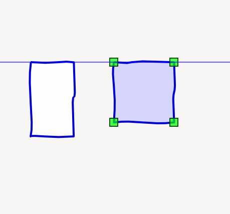

Guides
######

Guides are a tool to align elements with one another.

Guides consist of a couple of elements: aspects that hook into the item-drag cycle, and a dedicated painter.

    >>> from gaphas.view import GtkView
    >>> from gaphas.painter import PainterChain, ItemPainter, HandlePainter
    >>> from gaphas.tool import item_tool, pan_tool, zoom_tool
    >>> from gaphas.guide import GuidePainter
    >>> view = GtkView()
    >>> view.painter = (
    ...     PainterChain()
    ...     .append(ItemPainter(view.selection))
    ...     .append(HandlePainter(view))
    ...     .append(GuidePainter(view))
    ... )
    >>> view.add_controller(item_tool(view))
    >>> view.add_controller(pan_tool(view))
    >>> view.add_controller(zoom_tool(view))

You need to hook up the ``GuidePainter``. The aspect are loaded as soon as the module is loaded.
