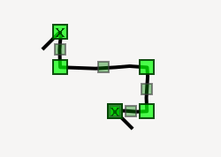

Line Segments
#############

The line segment functionality is an add-on, that will allow the user to add line segments to a line, and merge them.

To use this behavior, import the ``gaphas.segment`` module and add ``LineSegmentPainter`` to the list of painters for the view.
Add ``segment_tool`` to the view as a controller, in order to activate the split/merge segment behavior for ``Line`` instances.

    >>> from gaphas.view import GtkView
    >>> from gaphas.painter import PainterChain, ItemPainter, HandlePainter
    >>> from gaphas.tool import item_tool, scroll_tool, zoom_tool
    >>> from gaphas.segment import LineSegmentPainter, segment_tool
    >>> view = GtkView()
    >>> view.painter = (
    ...     PainterChain()
    ...     .append(ItemPainter(view.selection))
    ...     .append(HandlePainter(view))
    ...     .append(LineSegmentPainter(view.selection))
    ... )
    >>> view.add_controller(segment_tool(view))
    >>> view.add_controller(item_tool(view))
    >>> view.add_controller(scroll_tool(view))
    >>> view.add_controller(zoom_tool(view))
